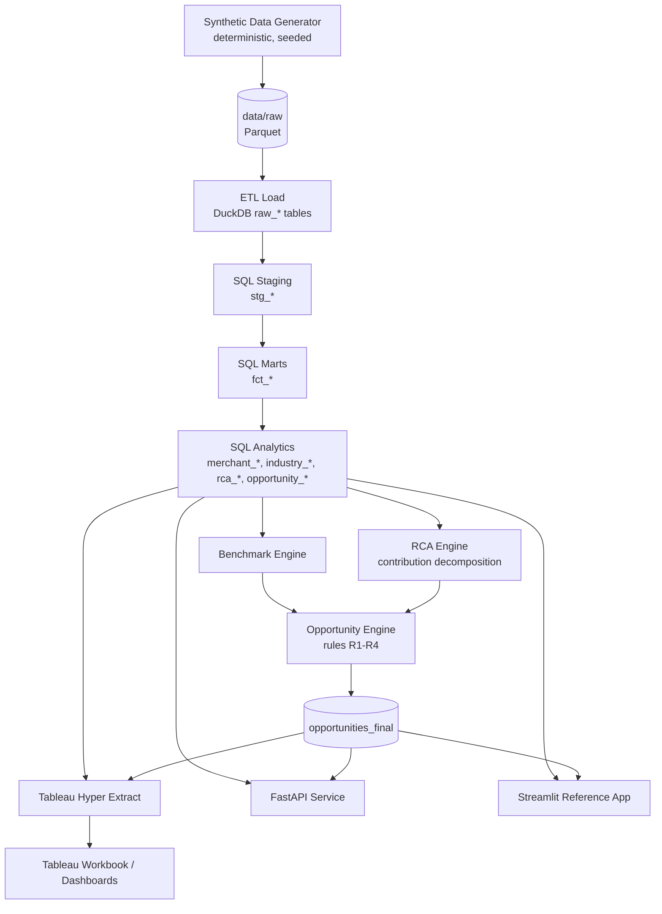

# Payment Growth Analytics Platform

A self-service analytics product that helps payment teams **monitor merchant performance, benchmark against peers, diagnose success-rate movements, and surface prioritised growth opportunities** — from a KPI movement to a data-backed explanation and a next step.

> **⚠️ Synthetic data only.** Every merchant, transaction and number in this repository is generated by a deterministic simulator. No real customer, merchant or payment data is used anywhere. See [Synthetic-data disclaimer](#synthetic-data-disclaimer).

The product loop:

```
Monitor → Benchmark → Diagnose → Identify Opportunity → Recommend Action → Measure Impact
```

**Stack:** Python 3.9+ · DuckDB (Trino-compatible SQL) · Tableau Hyper API · FastAPI · Streamlit · Plotly · pytest

---

## Table of contents

1. [Product overview](#product-overview)
2. [Architecture](#architecture)
3. [Quick start](#quick-start)
4. [Data generation](#data-generation)
5. [SQL pipeline](#sql-pipeline)
6. [KPI definitions](#kpi-definitions)
7. [Benchmark methodology](#benchmark-methodology)
8. [RCA methodology](#rca-methodology)
9. [Opportunity engine](#opportunity-engine)
10. [Tableau setup](#tableau-setup)
11. [API usage](#api-usage)
12. [Streamlit usage](#streamlit-usage)
13. [Testing](#testing)
14. [Known limitations](#known-limitations)
15. [Synthetic-data disclaimer](#synthetic-data-disclaimer)

---

## Product overview

Payment performance varies across merchants, industries, payment methods, issuers, devices, platforms, geographies and time. Answering "why did this merchant's success rate drop?" usually means ad-hoc SQL, manual joins, and one-off dashboards.

This platform replaces that with a standardised analytics product:

- **A single source of truth for KPIs** — one definition each for SR, TPV, transaction count, AOV, checkout conversion, share, failure rate and period-over-period changes.
- **Benchmarking** — a merchant vs. a documented peer group (industry + country + payment method), with sample-size guardrails.
- **RCA** — drill-down from an aggregate movement to contributing dimensions (payment method, card type, issuer, device, platform, error category, …).
- **An opportunity engine** — transparent rules that turn material movements and benchmark gaps into prioritised, explainable opportunity cards with a recommended investigation.
- **Two presentation layers** — a Tableau Hyper extract + workbook, and a fully runnable Streamlit reference app.
- **A reusable metrics API** — FastAPI endpoints for every metric above.

---

## Architecture



**Layers:** synthetic generator → DuckDB warehouse (staging → marts → analytics) → Python analytics engines (benchmark, RCA, opportunities) → three consumers (Tableau, FastAPI, Streamlit).

Design principles: metrics defined once and tested; every number traceable to data; contribution language never claims causality; benchmarks gated by minimum sample size.

---

## Quick start

Requires Python 3.9+ (this machine has 3.9.6; the code avoids 3.10+ syntax). No Docker, no Trino, no external services needed.

```bash
make setup          # create .venv, install deps
make demo           # generate → load → SQL → analytics → opportunities
make build-hyper    # Tableau extract
make test           # full test suite
make validate       # artifact + sanity checklist
```

Then, in separate terminals:

```bash
make run-api        # FastAPI on http://127.0.0.1:8000  (docs at /docs)
make run-app        # Streamlit on http://127.0.0.1:8501
```

Or step by step:

```bash
make generate-data  # write Parquet to data/raw
make load-data      # load into DuckDB
make run-sql        # run SQL models
make run-pipeline   # full pipeline incl. opportunities
make build-hyper    # build tableau/extracts/payment_growth.hyper
```

`ENVIRONMENT.md` records exactly what is available on the build machine.

---

## Data generation

Deterministic (seeded with `PGA_RANDOM_SEED=42`) synthetic data written to `data/raw/*.parquet`.

| Parameter | Default |
|---|---|
| Merchants | 150 |
| Industries | 12 |
| MCCs | 25 |
| Issuer banks | 10 |
| Payment methods | 5 (UPI, Credit Card, Debit Card, Netbanking, Wallet) |
| Devices | 3 (Mobile, Desktop, Tablet) |
| Platforms | 3 (Android, iOS, Web) |
| Error codes | 12 (10–12 categories) |
| Weeks | 10 |
| Transactions | ~1.15M |
| Checkout events | ~3.4M |

**Controlled scenarios** injected so tests have ground truth:

| # | Scenario | Merchant | Effect |
|---|---|---|---|
| S1 | SR decline | `M0013` Nova Fashion (E-commerce) | −3 to −5 pp in final 2 weeks |
| S2 | Android + Debit Card deterioration | `M0013` Nova Fashion | additional decline, concentrated on Android/Debit |
| S3 | Issuer error spike | `M0013`, HDFC | additional −4.5 pp on HDFC |
| S4 | Consistent underperformer | `M0042` Budget Grocer (Grocery) | −3.5 pp below industry |
| S5 | Strong improvement | `M0077` Swift Trips (Travel) | +3 pp in final 2 weeks |

The scenario manifest is written to `data/generated/scenario_manifest.json`.

---

## SQL pipeline

All transformations are real `.sql` files executed against DuckDB, written in Trino-compatible style. **DuckDB/Trino differences** are noted per file; the main ones:
- DuckDB `date_trunc('month', d)` and `EXTRACT(dow FROM d)` behave as in Trino. Trino would additionally allow `date_add('day', n, d)`.
- Window functions (`LAG`), `NULLIF`, `ANY_VALUE`, `CASE WHEN` are portable across both.
- No DuckDB-only syntax is used in the analytics models.

Order (`src/etl/sql.py`):

```
staging/stg_transactions.sql
staging/stg_merchants.sql
staging/stg_checkout_events.sql
marts/fct_payment_performance.sql
marts/fct_checkout_conversion.sql
analytics/merchant_daily_metrics.sql
analytics/merchant_weekly_metrics.sql
analytics/industry_benchmarks.sql
analytics/payment_method_metrics.sql
analytics/rca_metrics.sql
analytics/opportunity_candidates.sql
```

Every model is documented in [docs/data_dictionary.md](docs/data_dictionary.md). Smoke-test queries live in `sql/tests/`.

---

## KPI definitions

Centralised in `src/analytics/metrics.py` (pure, unit-tested) and mirrored in SQL. Full definitions in [docs/metric_definitions.md](docs/metric_definitions.md).

| KPI | Definition | Denominator protection |
|---|---|---|
| Success Rate | `authorized / eligible × 100` | `None` if eligible ≤ 0 |
| TPV | `SUM(amount)` over eligible | — |
| Transaction Count | `COUNT(DISTINCT transaction_id)` | — |
| AOV | `successful TPV / successful count` | `None` if count ≤ 0 |
| Failure Rate | `failed eligible / eligible × 100` | `None` if eligible ≤ 0 |
| Payment Method Share | `method TPV / total TPV × 100` | `None` if total ≤ 0 |
| Checkout Conversion | `successful sessions / started sessions × 100` | `None` if started ≤ 0 |
| PP delta (rates) | `current − previous` | `None` if either is `None` |
| % delta (absolute) | `(current − previous) / previous × 100` | `None` if previous = 0 |

**Eligible** = amount present and > 0. **Authorized** = `authorized_at IS NOT NULL` (per PRD). Checkout conversion is derived from the **checkout event table**, never from transaction counts.

---

## Benchmark methodology

`src/analytics/benchmark.py`. Peer group = **industry + country + payment method + date range**, with:

- Minimum transaction threshold (`PGA_BENCHMARK_MIN_TXNS`, default 500)
- Minimum peer-merchant count (`PGA_BENCHMARK_MIN_PEERS`, default 5)
- **Self-exclusion** — the target merchant is never in its own peer group
- **Weighted aggregate SR** (weighted by eligible volume)
- Returns peer count and sample size

`benchmark_status` ∈ `VALID` · `INSUFFICIENT_SAMPLE` · `NO_PEERS`. A benchmark is never presented as authoritative when the sample is insufficient. Full detail: [docs/metric_definitions.md](docs/metric_definitions.md).

---

## RCA methodology

`src/rca/engine.py`. Compares a **current** vs **previous** period and decomposes the SR movement across 10 dimensions:

`payment_method · payment_type · card_type · issuer_bank · device · platform · error_category · industry · mcc · country`

For each segment it computes current/previous SR, delta (pp), volumes, a **contribution** estimate and a **share of decline**. Contribution combines volume weight and rate movement:

```
contribution_s = (previous_volume_share_s) × (SR_s,current − SR_s,previous)
```

This is a documented heuristic, **not causal inference**. The UI and API deliberately use "contributor", "associated movement", "concentrated decline" — never "root cause". Full methodology: [docs/rca_methodology.md](docs/rca_methodology.md).

---

## Opportunity engine

`src/opportunities/engine.py`. Transparent rules over the latest 2-week vs prior 2-week window:

| Rule | Trigger |
|---|---|
| `RULE_SR_DECLINE` | SR delta ≤ −1.5 pp **and** volume ≥ min threshold |
| `RULE_BENCHMARK_GAP` | merchant SR ≤ benchmark − 2 pp **and** benchmark is `VALID` |
| `RULE_ERROR_SPIKE` | an error category's failure share rises ≥ 2 pp |
| `RULE_CONCENTRATED_SEGMENT` | one segment explains ≥ 25% of the decline |

Each opportunity carries the full schema (id, type, severity, metric, current/previous/benchmark values, delta, gap, affected volume, primary dimension, supporting evidence, recommended next step, confidence, created_at). `severity` ∈ `Critical` · `Attention` · `Opportunity`. `confidence` reflects **evidence quality** (sample size, benchmark validity), not causal certainty. Thresholds are configurable via `.env`.

---

## Tableau setup

A Hyper extract is built with the Tableau Hyper API:

```
tableau/extracts/payment_growth.hyper   (~2.4 MB, 7 datasets)
```

Datasets: `merchant_performance`, `industry_benchmark`, `rca`, `opportunities`, `checkout_conversion`, `payment_method_metrics`, `merchants`.

A workbook (`tableau/workbooks/payment_growth.twb`) with **five dashboards** (Executive Overview, Merchant Performance, Industry Benchmarking, RCA Explorer, Opportunity Center), documented calculated fields, and a datasource (`tableau/datasource/payment_growth.tds`) are generated. Tableau Desktop **2026.2 is installed** on the build machine, so the extract is openable; the workbook is validated **structurally** (well-formed XML, expected sheets/dashboards present).

Exact connection steps, calculated-field definitions, filters, and per-dashboard build instructions: [docs/tableau_setup.md](docs/tableau_setup.md).

> The workbook is **not** asserted to be visually validated. Structural validation + exact manual steps are provided instead, per the PRD's requirement.

---

## API usage

FastAPI service (`src/api/main.py`), OpenAPI docs at `/docs`.

```bash
make run-api
```

| Endpoint | Purpose |
|---|---|
| `GET /health` | health + table list |
| `GET /metrics/overview` | overall KPIs |
| `GET /metrics/merchant/{id}` | merchant KPIs + benchmark gap |
| `GET /metrics/industry/{industry}` | industry aggregate |
| `GET /metrics/trend?grain=week` | SR/TPV/count trend |
| `GET /metrics/payment-method` | per-method SR / TPV / share |
| `GET /metrics/rca?merchant_id=…` | RCA contributions |
| `GET /benchmarks/merchant/{id}` | benchmark + methodology |
| `GET /opportunities` | list (filter by severity/type/merchant) |
| `GET /opportunities/{id}` | single opportunity |

Example:

```
GET /metrics/merchant/M0013?start_date=2026-09-14&end_date=2026-09-27
```

All responses carry the period, filters, sample size, and (where relevant) benchmark metadata + data-quality warnings.

---

## Streamlit usage

```bash
make run-app     # http://127.0.0.1:8501
```

Six tabs mirroring the Tableau IA:

1. **Overview** — KPI cards, SR & TPV trend, payment-method mix, top opportunities
2. **Merchant Performance** — merchant KPIs, trend, method table, device/platform breakdown
3. **Benchmarking** — merchant vs industry, gap, peer count, sample size, scatter
4. **RCA Explorer** — current vs previous, contribution chart, drill-down table
5. **Opportunity Center** — filter by severity/type/industry, opportunity cards with evidence
6. **Data Quality** — record counts, violation counts, pipeline status

All values are computed live from DuckDB; nothing is hard-coded. Plotly charts use a consistent palette.

---

## Testing

```bash
make test            # all tests
make test -- -k rca  # subset
```

- **Unit** (`tests/unit/`) — every metric formula, benchmark, RCA, opportunity rules
- **Data quality** (`tests/data/`) — uniqueness, referential integrity, valid values, positive amounts, date validity, impossible timestamps, orphan references
- **Integration** (`tests/integration/`) — full artifact chain + API endpoints
- **Regression** (`tests/integration/test_regression_scenarios.py`) — the injected scenarios S1–S5 must be discovered by the engines

Regression assertions use tolerances, not exact floats. The known-degraded merchant must be detected; the improving merchant must not be flagged for decline.

---

## Known limitations

- **Synthetic data.** All results are from simulated data and must not be read as real business outcomes.
- **Python 3.9.6** used (PRD prefers 3.11+); code is written 3.9-compatible. Documented in `ENVIRONMENT.md`.
- **Contribution decomposition is a heuristic**, not causal inference. Association only.
- **Tableau workbook is structurally validated, not visually opened** by this build. Tableau Desktop is available for a human to open it; exact steps are documented.
- **Single country peer groups** can be small for rarer industries; benchmark status flags this rather than hiding it.
- **No authentication/authorisation** on the API or app (local reference implementation).

---

## Synthetic-data disclaimer

This project uses **synthetic data only**, generated deterministically from a seeded simulator. It contains:

- no real merchant, customer, or transaction records,
- no PII,
- no credentials or secrets (see `.env.example` for the configuration surface).

Generated bulk artifacts (`data/`, `*.duckdb`, `*.hyper`) are git-ignored and reproducible via `make demo`. Any resemblance of synthetic merchant names to real businesses is coincidental.

---

## Repository layout

```
payment-growth-analytics/
├── sql/               staging → marts → analytics (+ tests)
├── src/               config, data_generation, etl, analytics, rca,
│                      opportunities, api, tableau, common
├── app/streamlit/     reference application
├── tableau/           extracts, workbooks, datasource, documentation
├── tests/             unit, data, integration
├── docs/              architecture, data dictionary, metric defs, RCA, Tableau
├── scripts/           generate_data, load_data, run_sql, run_pipeline,
│                      build_hyper, validate_project
├── Makefile · pyproject.toml · requirements.txt · docker-compose.yml
├── README.md · PRD.md · ENVIRONMENT.md · CLAUDE_CODE_BUILD_PROMPT.md
└── BUILD_REPORT.md
```

## License

MIT — see `LICENSE`.
