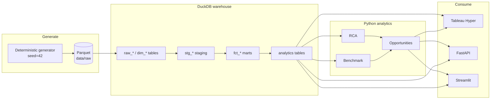

# Architecture

## Data flow



## Layers

| Layer | Location | Responsibility |
|---|---|---|
| Configuration | `src/config/settings.py` | typed, env-overridable settings; fixed vocabularies |
| Common | `src/common/` | DuckDB connection, query helper, structured logging |
| Generation | `src/data_generation/generator.py` | deterministic synthetic transactions, events, dimensions, scenarios |
| ETL | `src/etl/` | Parquet → DuckDB; ordered SQL execution |
| SQL | `sql/` | staging → marts → analytics, Trino-compatible |
| Metrics | `src/analytics/metrics.py` | pure, unit-tested KPI formulas |
| Benchmark | `src/analytics/benchmark.py` | peer-group benchmarking with guardrails |
| RCA | `src/rca/engine.py` | contribution decomposition |
| Opportunities | `src/opportunities/engine.py` | rules engine + persistence |
| API | `src/api/` | FastAPI service + Pydantic models |
| Tableau | `src/tableau/` | Hyper extract + workbook/datasource generation |
| App | `app/streamlit/app.py` | reference UI |

## Table lineage

```
raw_payment_transactions ─┐
raw_merchants ────────────┼─▶ stg_transactions ─┐
raw_checkout_events ──────┘  stg_merchants ────┼─▶ fct_payment_performance ─┐
                             stg_checkout_events┘  fct_checkout_conversion  │
                                                                              ▼
                            merchant_daily_metrics ─▶ merchant_weekly_metrics ─▶ opportunity_candidates
                            industry_benchmarks
                            payment_method_metrics
                            rca_metrics
                            opportunities_final  (written by the Python opportunity engine)
```

## Reproducibility

- Fixed seed (`PGA_RANDOM_SEED=42`), fixed reference date (`2026-09-27`), fixed scenario IDs.
- Regenerating from scratch yields byte-identical raw Parquet.
- Every derived number traces to raw Parquet via documented SQL or a pure Python function.

## Failure handling

- The SQL runner raises on the first error (no silent continue).
- The opportunity engine isolates per-merchant failures so one bad merchant cannot abort a run.
- Structured logs (JSON to stderr) + a machine-readable run summary per pipeline stage.
